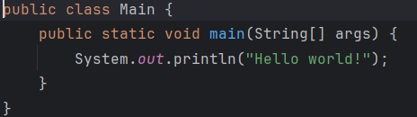

### JAVA

## Ngôn ngữ Java là gì?
Java là một trong những ngôn ngữ lập trình hướng đối tượng. Ngôn ngữ Java được sử dụng phổ biến trong phát triển phần mềm, trang web, game hay ứng dụng trên các thiết bị di động.

Java được khởi đầu bởi James Gosling và bạn đồng nghiệp ở Sun MicroSystem năm 1991. Ban đầu Java được tạo ra nhằm mục đích viết phần mềm cho các sản phẩm gia dụng, và có tên là Oak. Java được chính thức phát hành năm 1994, đến năm 2010 được Oracle mua lại từ Sun MicroSystem.
## Lí do ra đời của Java
Java được tạo ra để giải quyết vấn đề phát triển phần mềm đa nền tảng. Khi máy tính và thiết bị khác nhau ngày càng phổ biến, nhu cầu về một ngôn ngữ lập trình có khả năng chạy trên nhiều loại thiết bị và hệ điều hành trở nên cần thiết. Java ra đời với khả năng "Write Once, Run Anywhere" (viết một lần, chạy mọi nơi), giúp lập trình viên tiết kiệm thời gian và công sức khi phát triển phần mềm đa nền tảng.
## Cách hoạt động của JAVA, điều gì xảy ra khi chạy java(.java)
cách hoạt động:
* Mã Nguồn và cú pháp
   1. Lập trình viên viết chương trình Java bằng cách sử dụng mã nguồn (source code) với cú pháp đặc trưng của Java. Các tệp mã nguồn Java có đuôi .java và chứa các định nghĩa lớp (class), phương thức (method), và các biến (variable). Ví dụ:
     ```php
    public class HelloWorld {
        public static void main(String[] args) {
            System.out.println("Hello, World!");
        }
    }   
    ```
* Biên dịch mã Nguồn
  * Java sử dụng trình biên dịch Java (Javac) để biên dịch mã nguồn từ file .java thành bytecode, một dạng mã máy cấp thấp mà máy ảo Java (JVM) có thể hiểu và thực thi. Sau khi biên dịch, tệp bytecode được tạo ra và có phần mở rộng .class.
  * Ví dụ: Khi bạn biên dịch tệp HelloWorld.java bằng lệnh javac HelloWorld.java, nó sẽ tạo ra tệp HelloWorld.class.
  * Điểm đặc biệt là bytecode của Java không phải là mã máy của bất kỳ nền tảng phần cứng cụ thể nào, nó là mã trung gian.
* Máy ảo Java(JVM)
    * JVM (Java Virtual Machine) là thành phần chính giúp Java đạt được tính đa nền tảng (write once, run anywhere - WORA). JVM thực thi các bytecode .class và chuyển đổi chúng thành mã máy phù hợp với hệ điều hành và phần cứng của máy tính.
* Chạy chương trình trên JVM
    * Chạy phương thức main(), đây là điểm bắt đầu của chương trình.
    * Sử dụng **trình thông dịch** hoặc **JIT compiler** để chuyển bytecode thành mã máy cho nền tảng cụ thể và thực hiện lệnh.
    * **Quản lý bộ nhớ** với garbage collection: JVM tự động quản lý và giải phóng bộ nhớ cho các đối tượng không còn được sử dụng, đảm bảo chương trình chạy mượt mà mà không bị thiếu bộ nhớ.
    
    
## Cấu trúc 1 Chương trình Java

## Package là gì
**Package trong Java** được sử dụng để nhóm các lớp liên quan. Hãy nghĩ về nó như một thư mục trong một thư mục tập tin. 
* Các Package được sử dụng phổ biến và tích hợp sẵn trong Java bao gồm:

    1. Java.lang: Package được import tự động, chứa các lớp hỗ trợ ngôn ngữ. Ví dụ các kiểu dữ liệu nguyên thủy, hoặc phép toán.

    2. Java.util: Bao gồm các lớp tiện ích, thực hiện cấu trúc dữ liệu: danh sách liên kết, hoạt động date/time

    3. Java awt: Bao gồm các class triển khai thành phần cho giao diện sử dụng đồ hoại, có thể là: button, menu…

    4. Java.io: là các lớp chỗ trợ IN/OUTPUT (I/O)

    5. Java.net: Bao gồm các lớp để hỗ trợ thao tác network

    6. Java.applet: Bao gồm các lớp để tạo Applet
## **Syntax cơ bản bao gồm:**
## Khai báo biến nguyên thủy
```php
int n;// kiểu số nguyên
float m;// Kiểu số thực
string a;// Kiểu xâu
bool bien=true;// Kiểu bool
```
## làm quen với vòng lặp:
```php
    for(int i=0;i<n;++i){
        System.out.println(i);
    }
    int n=100;
    while(n--){
        System.out.println("Toiyeuptit");
    }
```
## Câu lệnh Rẽ Nhánh:
```php
    int n=6;
    if(n>5){
        System.out.println("n>5");
    }
    else {
        System.out.println("n<5");
    }
```
## Mảng Trong Java
* Mảng 1 chiều:
```php
    int[] a;
    a=new int[3];
    a[0]=1;
    a[1]=2;
    a[2]=3;
    for(int i=0;i<3;++i){
        System.out.println(a[i]);
    }
```
* Mảng đa chiều:
```php
    //int [][]a=new int[2][2];
    int[][] a={{1,2,3},{4,5,6},{7,8,9}};
    for(int i=0;i<3;++i){
        for(int j=0;j<3;++j){
            System.out.print(a[i][j]+" ");
        }
        System.out.println();
    }
```
## Tổng quan về Class và Object:


1. **This**: *this* là một từ khóa trong Java dùng để tham chiếu đến đối tượng hiện tại của lớp. Nó thường được sử dụng để phân biệt giữa các biến instance và các tham số của phương thức hoặc constructor.
```php
    puclic class SV{
        string name;
        puclic SV(string name){
            this.name=name;
        }
    }
```
 2. **constructor:** Constructor là một phương thức đặc biệt được gọi khi tạo một đối tượng. Nó có cùng tên với lớp và không có kiểu trả về. Ví dụ:
```php
    puclic class SV{
        string name;
        // constructor
        puclic SV(string name){
            this.name=name;
        }
    }
```
3. Ý nghĩa: **Access modifier** (các bộ điều chỉnh truy cập) xác định quyền truy cập của các thành viên lớp (biến, phương thức). Java hỗ trợ bốn loại access modifier: public: Có thể truy cập từ bất kỳ đâu. private: Chỉ có thể truy cập trong lớp đó. protected: Có thể truy cập trong cùng một lớp, lớp con, và trong cùng một package. default (không có từ khóa): Chỉ có thể truy cập trong cùng một package. Ví dụ:
```php
    puclic class SV{
        private string name;
        puclic void setname(string name){
            this.name=name;
        }
    }
```
4. **getter và setter**:Getter và setter là các phương thức được sử dụng để truy cập và cập nhật giá trị của các biến private trong một lớp. Chúng giúp bảo vệ dữ liệu và duy trì tính đóng gói (encapsulation). Ví dụ:
```php
    public class Dog {
        private String name;
        // Getter
        public String getName() {
            return name;
        }
        // Setter
        public void setName(String name) {
            this.name = name;
        }
}
```
5. **Static** static là một từ khóa dùng để chỉ rằng một thành viên (biến hoặc phương thức) thuộc về lớp chứ không thuộc về các thể hiện (đối tượng) của lớp. Biến static có thể được truy cập mà không cần tạo một đối tượng của lớp. Ví dụ:
```php
    public class sv {
    static int total = 0; // Biến static để đếm số lượng sv

    public sv() {
        total++; // Tăng biến count mỗi khi nhận 1 sv
    }

    public static void showCount() {
        System.out.println("số lượng sv " + count);
    }
}
``` 